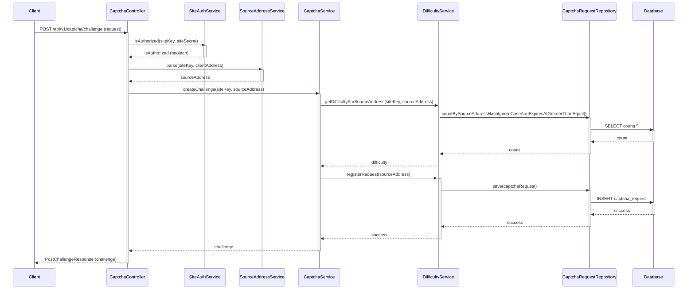
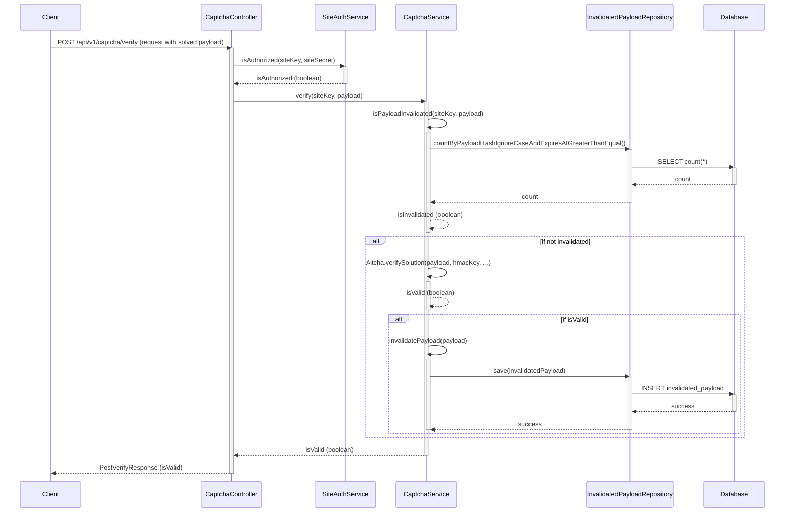

# Captcha Service Sequence Diagram

## Challenge

```mermaid
sequenceDiagram
    participant Client
    participant CaptchaController
    participant SiteAuthService
    participant SourceAddressService
    participant CaptchaService
    participant DifficultyService
    participant CaptchaRequestRepository
    participant Database

    Client->>CaptchaController: POST /api/v1/captcha/challenge (request)
    activate CaptchaController
    CaptchaController->>SiteAuthService: isAuthorized(siteKey, siteSecret)
    activate SiteAuthService
    SiteAuthService-->>CaptchaController: isAuthorized (boolean)
    deactivate SiteAuthService
    CaptchaController->>SourceAddressService: parse(siteKey, clientAddress)
    activate SourceAddressService
    SourceAddressService-->>CaptchaController: sourceAddress
    deactivate SourceAddressService
    CaptchaController->>CaptchaService: createChallenge(siteKey, sourceAddress)
    activate CaptchaService
    CaptchaService->>DifficultyService: getDifficultyForSourceAddress(siteKey, sourceAddress)
    activate DifficultyService
    DifficultyService->>CaptchaRequestRepository: countBySourceAddressHashIgnoreCaseAndExpiresAtGreaterThanEqual()
    activate CaptchaRequestRepository
    CaptchaRequestRepository->>Database: SELECT count(*)
    activate Database
    Database-->>CaptchaRequestRepository: count
    deactivate Database
    CaptchaRequestRepository-->>DifficultyService: count
    deactivate CaptchaRequestRepository
    DifficultyService-->>CaptchaService: difficulty
    CaptchaService->>DifficultyService: registerRequest(sourceAddress)
    activate DifficultyService
    DifficultyService->>CaptchaRequestRepository: save(captchaRequest)
    activate CaptchaRequestRepository
    CaptchaRequestRepository->>Database: INSERT captcha_request
    activate Database
    Database-->>CaptchaRequestRepository: success
    deactivate Database
    CaptchaRequestRepository-->>DifficultyService: success
    deactivate CaptchaRequestRepository
    DifficultyService-->>CaptchaService: success
    deactivate DifficultyService
    CaptchaService-->>CaptchaController: challenge
    deactivate CaptchaService
    CaptchaController-->>Client: PostChallengeResponse (challenge)
    deactivate CaptchaController
```

## Verify

```mermaid
sequenceDiagram
    participant Client
    participant CaptchaController
    participant SiteAuthService
    participant CaptchaService
    participant InvalidatedPayloadRepository
    participant Database

    Client->>CaptchaController: POST /api/v1/captcha/verify (request with solved payload)
    activate CaptchaController
    CaptchaController->>SiteAuthService: isAuthorized(siteKey, siteSecret)
    activate SiteAuthService
    SiteAuthService-->>CaptchaController: isAuthorized (boolean)
    deactivate SiteAuthService
    CaptchaController->>CaptchaService: verify(siteKey, payload)
    activate CaptchaService
    CaptchaService->>CaptchaService: isPayloadInvalidated(siteKey, payload)
    activate CaptchaService
    CaptchaService->>InvalidatedPayloadRepository: countByPayloadHashIgnoreCaseAndExpiresAtGreaterThanEqual()
    activate InvalidatedPayloadRepository
    InvalidatedPayloadRepository->>Database: SELECT count(*)
    activate Database
    Database-->>InvalidatedPayloadRepository: count
    deactivate Database
    InvalidatedPayloadRepository-->>CaptchaService: count
    deactivate InvalidatedPayloadRepository
    CaptchaService-->>CaptchaService: isInvalidated (boolean)
    deactivate CaptchaService
    alt if not invalidated
        CaptchaService->>CaptchaService: Altcha.verifySolution(payload, hmacKey, ...)
        activate CaptchaService
        CaptchaService-->>CaptchaService: isValid (boolean)
        deactivate CaptchaService
        alt if isValid
            CaptchaService->>CaptchaService: invalidatePayload(payload)
            activate CaptchaService
            CaptchaService->>InvalidatedPayloadRepository: save(invalidatedPayload)
            activate InvalidatedPayloadRepository
            InvalidatedPayloadRepository->>Database: INSERT invalidated_payload
            activate Database
            Database-->>InvalidatedPayloadRepository: success
            deactivate Database
            InvalidatedPayloadRepository-->>CaptchaService: success
            deactivate InvalidatedPayloadRepository
            deactivate CaptchaService
        end
    end
    CaptchaService-->>CaptchaController: isValid (boolean)
    deactivate CaptchaService
    CaptchaController-->>Client: PostVerifyResponse (isValid)
    deactivate CaptchaController
```
