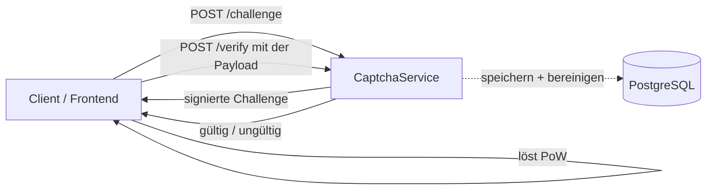
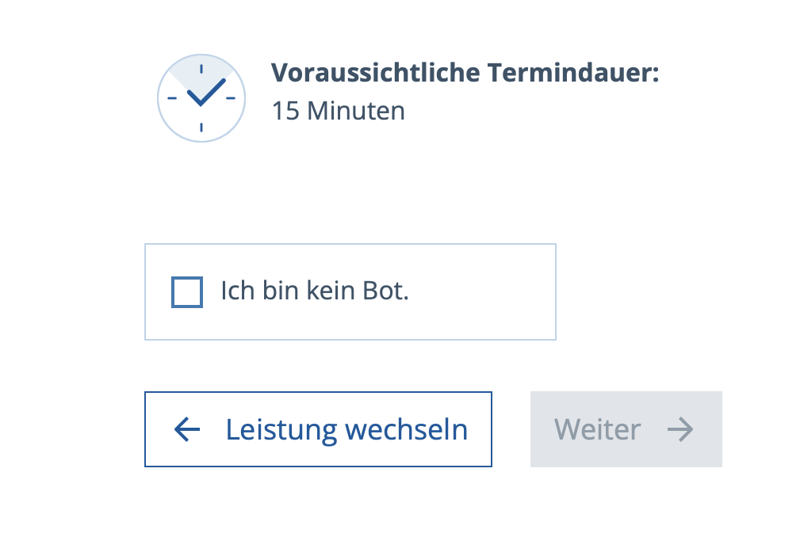

# CaptchaService-Dokumentation

Dieses Handbuch ist der zentrale Einstiegspunkt auf [GitHub Pages](https://it-at-m.github.io/captchaservice/de/). Es ist mit dem Repository (`main`) versioniert.

- **GitHub-Repository**: [https://github.com/it-at-m/captchaservice/](https://github.com/it-at-m/captchaservice/)
- **Aktuelle Releases**: [github.com/it-at-m/captchaservice/releases](https://github.com/it-at-m/captchaservice/releases)
- **Maven-Koordinaten**: `de.muenchen.captchaservice:captchaservice-backend`

## Schnellzugriff

- [Projektgeschichte](./overview/project-history.md) — warum es CaptchaService gibt und wo er heute eingesetzt wird
- [Architektur](./overview/architecture.md) — Komponentenübersicht
- [Releases](./overview/releases.md) — Versionierung und Veröffentlichung von Artefakten
- [Voraussetzungen](./getting-started/prerequisites.md)
- [Schnellstart](./getting-started/quick-start.md) — den Dienst lokal in Betrieb nehmen
- [Umgebungsvariablen](./configuration/environment-variables.md)
- [Site-Konfiguration](./configuration/sites.md) — mandantenfähige Sites, Geheimnisse und Schwierigkeits-Maps
- [Challenge anlegen](./api/challenge.md) und [Lösung prüfen](./api/verify.md)
- [Datenbank und Migrationen](./operations/database.md)
- [Monitoring](./operations/monitoring.md)

## Über CaptchaService

**CaptchaService** ist ein Spring-Boot-Microservice, der Proof-of-Work-CAPTCHA-Challenges auf Basis der [ALTCHA-Bibliothek](https://altcha.org/) bereitstellt — eine DSGVO-konforme, datenschutzfreundliche Alternative zu klassischen Bild-CAPTCHAs, [in Europa entwickelt](https://altcha.org/), ohne Cookies, ohne Tracking und ohne Drittanbieter-Aufrufe. Die Wahl einer quelloffenen, europäischen Bibliothek ist für uns ein bewusster Beitrag zur **digitalen Souveränität** der öffentlichen Verwaltung. CaptchaService ergänzt sie um adaptive Schwierigkeitssteuerung und Mehrmandantenfähigkeit.

CaptchaService ist die quelloffene Bot-Schutzschicht vor den öffentlichen **ZMS-/eAppointment**-APIs der Landeshauptstadt München. Er löst jahrelange Versuche mit eigenen und externen CAPTCHAs durch einen datenschutzfreundlichen Proof-of-Work-Ablauf ab, der vollständig auf dem Client läuft.

### Funktionen

- **Proof-of-Work-CAPTCHA**: kryptografische Challenges via ALTCHA, keine Bilderrätsel.
- **Adaptive Schwierigkeit**: Schwierigkeit skaliert automatisch mit dem Anfrageverhalten der Quell-IP.
- **Mehrmandantenfähigkeit**: mehrere Sites parallel, je mit eigenem Schlüssel, Geheimnis und eigener Schwierigkeits-Map.
- **Validierung der Quell-IP**: IP-Filter und CIDR-Allowlisting.
- **Geplante Bereinigung**: abgelaufene Challenges und entwertete Payloads werden im Hintergrund entfernt.
- **Monitoring**: Health-Checks und Prometheus-Metriken über Spring Actuator.
- **Persistenz**: PostgreSQL-Speicherung mit automatisierten Flyway-Migrationen.

### Technologien

- [Java 21](https://www.oracle.com/java/)
- [Spring Boot 3.x](https://spring.io/projects/spring-boot)
- [ALTCHA](https://altcha.org/) — Proof-of-Work-CAPTCHA-Bibliothek
- [PostgreSQL 16+](https://www.postgresql.org/)
- [Flyway](https://flywaydb.org/) — Datenbankmigrationen
- [Maven](https://maven.apache.org/)

### Ablauf auf hoher Ebene

### Lizenz

Veröffentlicht unter der [MIT-Lizenz](https://github.com/it-at-m/captchaservice/blob/main/LICENSE).

## Screenshot

CaptchaService im Einsatz auf der öffentlichen Terminbuchungsseite `zmscitizenview` der Landeshauptstadt München — eine unauffällige „Ich bin kein Bot“-Checkbox, hinterlegt mit einer ALTCHA-Proof-of-Work-Challenge.

## Kontakt

[Übersicht](https://opensource.muenchen.de/)

Kontakt München: it@M – opensource@muenchen.de

CaptchaService wurde bei **it@M**, dem IT-Dienstleister der Landeshauptstadt München, entwickelt. Die vollständige Geschichte steht in der [Projektgeschichte](./overview/project-history.md).

<table border="0" cellpadding="0" cellspacing="0">
  <tr>
    <td style="padding-right: 30px;"></td>
    <td></td>
  </tr>
</table>
