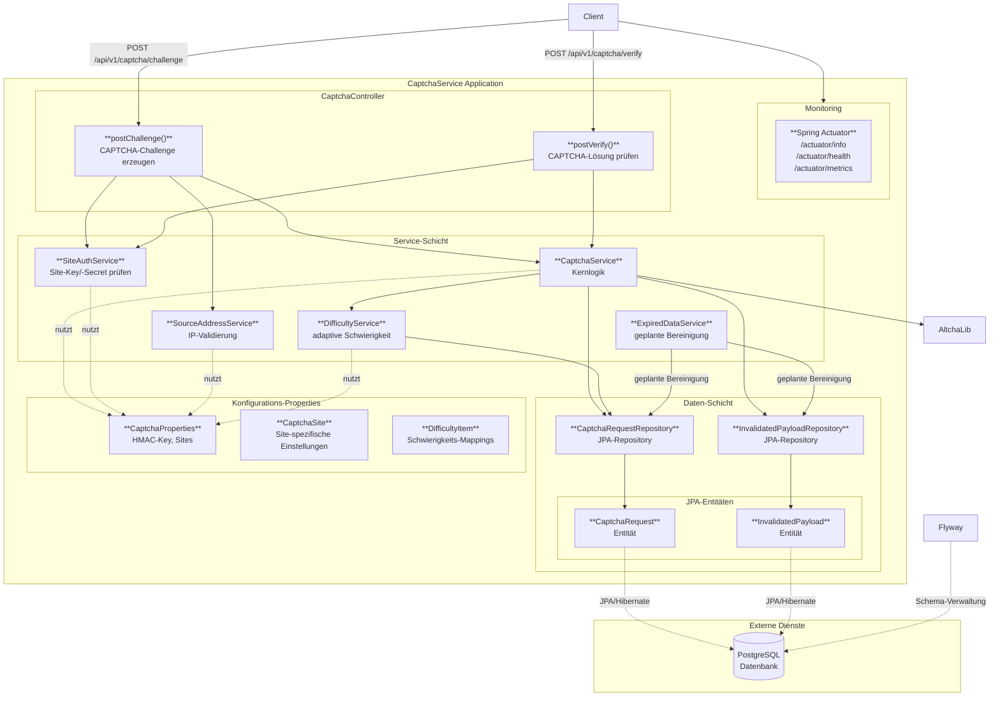

# Architektur

CaptchaService ist eine einzelne Spring-Boot-Anwendung mit einer PostgreSQL-Datenbank im Hintergrund. Sämtlicher öffentlicher Traffic kommt über `CaptchaController` herein und wird an eine schmale Service-Schicht delegiert; JPA-Repositories speichern den Zustand von Challenges und Entwertungen in PostgreSQL.

## Komponentendiagramm

## Komponenten

- **`CaptchaController`** — REST-Einstiegspunkt. Stellt `POST /api/v1/captcha/challenge` und `POST /api/v1/captcha/verify` bereit.
- **`CaptchaService`** — erzeugt und verifiziert Challenges; kapselt die ALTCHA-Bibliothek.
- **`DifficultyService`** — bestimmt die Schwierigkeit pro Site und Quell-IP anhand des jüngsten Anfrageverhaltens.
- **`SiteAuthService`** — prüft das von Clients mitgeschickte `siteKey` / `siteSecret`-Paar.
- **`SourceAddressService`** — validiert die Client-IP gegen die Site-Allowlist bzw. das Beobachtungsfenster.
- **`ExpiredDataService`** — geplanter Job, der abgelaufene Challenges und entwertete Payloads löscht.
- **JPA-Schicht** — zwei Repositories (`CaptchaRequestRepository`, `InvalidatedPayloadRepository`), Hibernate-Entitäten, PostgreSQL.
- **Flyway** — verwaltet Schema-Migrationen unter `src/main/resources/db/migration/`.
- **Spring Actuator** — stellt `/actuator/health`, `/actuator/info`, `/actuator/metrics` und `/actuator/prometheus` bereit.

## Anfragefluss

1. Der Client schickt `siteKey`, `siteSecret` und `clientAddress` per POST an `/api/v1/captcha/challenge`.
2. `SiteAuthService` authentifiziert die Site, `SourceAddressService` prüft die IP, `DifficultyService` wählt die passende Schwierigkeit anhand der Site-Schwierigkeits-Map und der jüngsten Aufrufe.
3. `CaptchaService` lässt ALTCHA eine signierte Challenge erzeugen, persistiert einen `CaptchaRequest` und liefert die Challenge zurück.
4. Der Client löst den Proof-of-Work und schickt die gelöste Payload per POST an `/api/v1/captcha/verify`.
5. `CaptchaService` prüft Signatur und HMAC, markiert die Payload als entwertet (damit sie nicht erneut verwendet werden kann) und antwortet mit `{ "valid": true | false }`.
