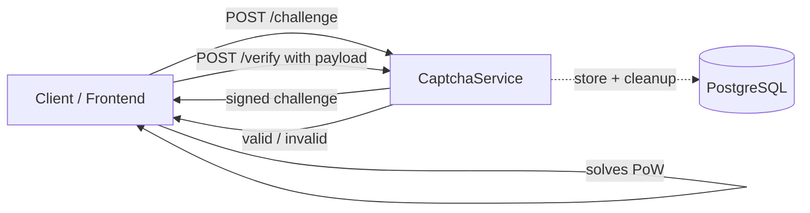

# CaptchaService Documentation

This handbook is the main entry point on [GitHub Pages](https://it-at-m.github.io/captchaservice/). It is versioned with the repository (`main`).

- **GitHub Repository**: [https://github.com/it-at-m/captchaservice/](https://github.com/it-at-m/captchaservice/)
- **Latest releases**: [github.com/it-at-m/captchaservice/releases](https://github.com/it-at-m/captchaservice/releases)
- **Maven coordinates**: `de.muenchen.captchaservice:captchaservice-backend`

## Quick Links

- [Project History](./overview/project-history.md) — why CaptchaService exists and where it is used today
- [Architecture](./overview/architecture.md) — high-level component diagram
- [Releases](./overview/releases.md) — versioning and how artifacts are published
- [Prerequisites](./getting-started/prerequisites.md)
- [Quick Start](./getting-started/quick-start.md) — get the service running locally
- [Environment Variables](./configuration/environment-variables.md)
- [Site Configuration](./configuration/sites.md) — multi-tenant sites, secrets and difficulty maps
- [Create Challenge](./api/challenge.md) and [Verify Solution](./api/verify.md)
- [Database and Migrations](./operations/database.md)
- [Monitoring](./operations/monitoring.md)

## About CaptchaService

**CaptchaService** is a Spring Boot microservice that provides proof-of-work CAPTCHA challenges using the [ALTCHA library](https://altcha.org/) — a GDPR-compliant, privacy-first alternative to traditional image-based CAPTCHAs, [made in Europe](https://altcha.org/), with no cookies, no tracking, and no third-party calls. Picking an open-source, European library is a deliberate vote for **digital sovereignty** in the public sector. CaptchaService adds adaptive difficulty management and multi-tenant support on top.

CaptchaService is the open-source bot-protection layer in front of the public **ZMS / eAppointment** APIs operated by the City of Munich (Landeshauptstadt München). It replaces years of in-house and third-party CAPTCHA attempts with a privacy-friendly proof-of-work flow that runs entirely on the client.

### Features

- **Proof-of-Work CAPTCHA**: ALTCHA-based crypto challenges, no image puzzles.
- **Adaptive Difficulty**: Difficulty scales automatically with the request pattern of a source address.
- **Multi-Tenant Support**: Multiple sites configured side by side, each with its own key, secret and difficulty map.
- **Source Address Validation**: IP-based filtering and CIDR allow-listing.
- **Scheduled Cleanup**: Expired challenges and invalidated payloads are removed in the background.
- **Monitoring**: Health checks and Prometheus metrics via Spring Actuator.
- **Database Persistence**: PostgreSQL storage with automated Flyway migrations.

### Built With

- [Java 21](https://www.oracle.com/java/)
- [Spring Boot 3.x](https://spring.io/projects/spring-boot)
- [ALTCHA](https://altcha.org/) — proof-of-work CAPTCHA library
- [PostgreSQL 16+](https://www.postgresql.org/)
- [Flyway](https://flywaydb.org/) — database migrations
- [Maven](https://maven.apache.org/)

### High-Level Flow

### License

Distributed under the [MIT License](https://github.com/it-at-m/captchaservice/blob/main/LICENSE).

## Screenshot

CaptchaService in action on the public `zmscitizenview` appointment-booking page (Landeshauptstadt München) — an unobtrusive "Ich bin kein Bot" checkbox backed by an ALTCHA proof-of-work challenge.

## Contact

[Overview](https://opensource.muenchen.de/)

Munich contact: it@M – opensource@muenchen.de

CaptchaService was built at **it@M**, the IT service provider of the Landeshauptstadt München. See [Project History](./overview/project-history.md) for the full story.

<table border="0" cellpadding="0" cellspacing="0">
  <tr>
    <td style="padding-right: 30px;"></td>
    <td></td>
  </tr>
</table>
