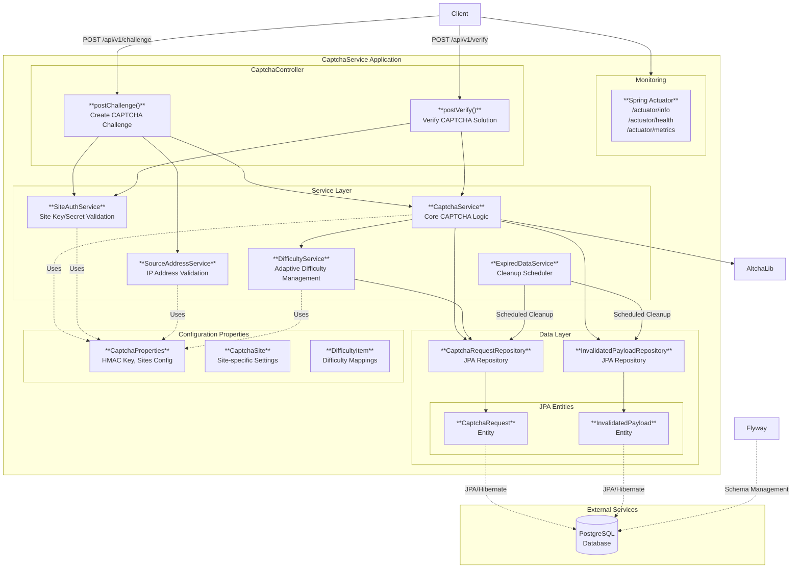

# Architecture

CaptchaService is a single Spring Boot application backed by a PostgreSQL database. All public traffic enters through `CaptchaController`, which delegates to a thin service layer; JPA repositories persist the challenge and invalidation state to PostgreSQL.

## Component Diagram

## Components

- **`CaptchaController`** — REST entry point. Exposes `POST /api/v1/captcha/challenge` and `POST /api/v1/captcha/verify`.
- **`CaptchaService`** — core challenge generation and verification, wrapping the ALTCHA library.
- **`DifficultyService`** — computes the proof-of-work difficulty for a given site and source address, based on recent traffic.
- **`SiteAuthService`** — validates the `siteKey` / `siteSecret` pair sent by every client.
- **`SourceAddressService`** — validates the client IP against the per-site allow-list / observation window.
- **`ExpiredDataService`** — scheduled job that removes expired challenges and invalidated payloads.
- **JPA layer** — two repositories (`CaptchaRequestRepository`, `InvalidatedPayloadRepository`) backed by Hibernate entities and PostgreSQL.
- **Flyway** — manages schema migrations under `src/main/resources/db/migration/`.
- **Spring Actuator** — exposes `/actuator/health`, `/actuator/info`, `/actuator/metrics`, and `/actuator/prometheus`.

## Request Flow

1. The client POSTs `siteKey`, `siteSecret`, and `clientAddress` to `/api/v1/captcha/challenge`.
2. `SiteAuthService` authenticates the site, `SourceAddressService` validates the IP, and `DifficultyService` picks the right difficulty based on the per-site difficulty map and recent visit count.
3. `CaptchaService` asks ALTCHA to generate a signed challenge, persists a `CaptchaRequest`, and returns the challenge.
4. The client solves the proof-of-work and POSTs the solved payload to `/api/v1/captcha/verify`.
5. `CaptchaService` verifies the signature and HMAC, marks the payload invalidated (so it cannot be reused), and returns `{ "valid": true | false }`.
